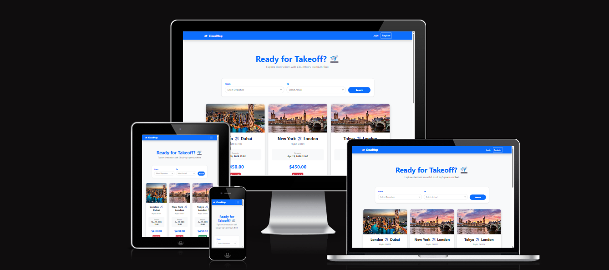
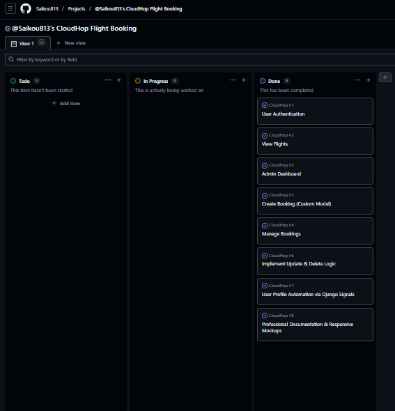
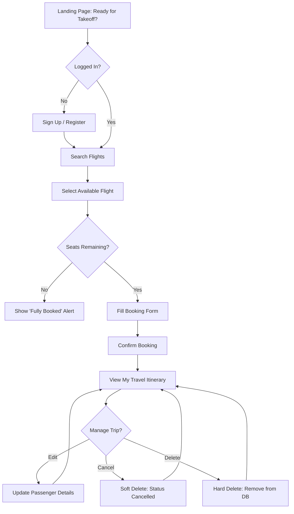
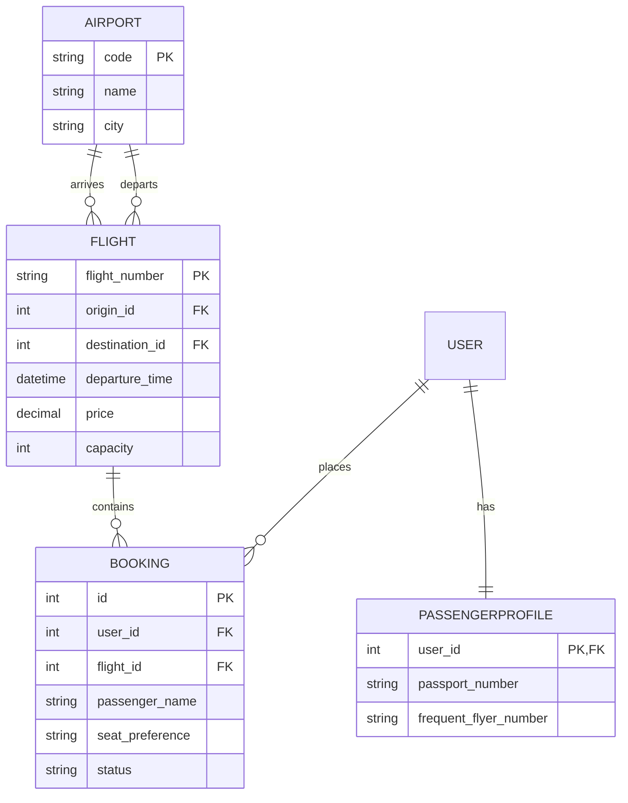

# ☁️ CloudHop | Full-Stack Flight Booking System

## Ready for Takeoff? 🛫



CloudHop is a premium flight booking platform built with **Django** and **PostgreSQL**. It allows users to search for real-time flight routes, manage personal travel itineraries with full CRUD functionality, and maintain a secure travel profile.

**[Visit the Live Website](https://cloud-hop-5647c9f84dbd.herokuapp.com)**

---

## 🎨 UX Design

This project was developed using **Agile methodologies**. The design focus was on a "Clean Sky" aesthetic—effortless navigation for travelers in a hurry.

### **User Stories**

- **Flight Search:** As a User, I can search for flights by origin and destination.

- **Booking:** As a User, I can book a flight and receive a confirmation.

- **Manage Itinerary:** As a User, I can view, edit, and cancel my bookings.

- **User Profile:** As a User, I can save my passport and frequent flyer details.

- **Admin Management:** As a Staff Member, I can manage flights via the admin dashboard.

### **Project Management**

The development was managed using an Agile Kanban board to track features to completion.

| Project Board: Status - Done 8 |
| :---: |
|  |

- **[View the Live Agile Project Board](https://github.com)**

---

## 🚀 Key Features

- **Smart Flight Search:** Filter by origin and destination using dynamic dropdowns and Django Q objects.

- **Full CRUD Itinerary:**
  - **Create:** Book flights with real-time seat tracking.
  - **Read:** View personalized trip cards with destination imagery.
  - **Update:** Edit passenger names and seat preferences.
  - **Delete/Rebook:** "Soft-delete" (cancel) or "Hard-delete" (wipe) bookings.

- **User Profiles:** Automatic profile creation via **Django Signals**.

- **Responsive UI:** A premium "Cloud-Grey" aesthetic built with **Bootstrap 5**.

---

## 🛠️ Technologies

- **Backend:** Django 4.2 (Python 3.12)

- **Database:** PostgreSQL (Heroku Postgres)

- **Image Hosting:** Cloudinary

- **Authentication:** Django Allauth

- **Deployment:** Heroku

- **Frontend:** HTML5 / CSS3 / JavaScript / Bootstrap 5

### **Full Dependency List**

```text
asgiref==3.7.2
cloudinary==1.36.0
crispy-bootstrap5==0.7
dj-database-url==0.5.0
dj3-cloudinary-storage==0.0.6
Django==4.2.11
django-allauth==0.57.2
django-crispy-forms==2.1
gunicorn==20.1.0
psycopg2==2.9.9
sqlparse==0.4.4
whitenoise==5.3.0
```

---

## 🗄️ Database Schema

### **Airport Model**

| Name | Type | Purpose | Validation |
| :--- | :--- | :--- | :--- |
| `code` | CharField | 3-letter IATA code for the airport | Max_length=3, Unique=True |
| `name` | CharField | Full name of the airport | Max_length=100 |
| `city` | CharField | The city where the airport is located | Max_length=100 |

### **Flight Model**

| Name | Type | Purpose | Validation |
| :--- | :--- | :--- | :--- |
| `flight_number` | CharField | Unique identifier for the flight | Unique=True |
| `origin` | ForeignKey | Starting airport (links to Airport model) | Related_name="departures" |
| `destination` | ForeignKey | Arrival airport (links to Airport model) | Related_name="arrivals" |
| `departure_time` | DateTimeField | Date and time of departure | Required |
| `price` | DecimalField | Cost of the flight ticket | Max_digits=10, 2 dec places |
| `flight_image` | CloudinaryField | Destination photo for the search cards | Default='placeholder' |
| `capacity` | PositiveIntegerField | Total seats available on the aircraft | Default=150 |

### **Booking Model**

| Name | Type | Purpose | Validation |
| :--- | :--- | :--- | :--- |
| `user` | ForeignKey | The user who made the booking | Required |
| `flight` | ForeignKey | The specific flight being booked | Required |
| `passenger_name` | CharField | Name of the person traveling | Max_length=100 |
| `seat_preference` | CharField | Passenger's choice of Window or Aisle | Window / Aisle choices |
| `status` | CharField | Tracks if the trip is Confirmed or Cancelled | Confirmed / Cancelled |
| `created_at` | DateTimeField | Timestamp of when the booking was made | Auto_now_add=True |

### **PassengerProfile Model**

| Name | Type | Purpose | Validation |
| :--- | :--- | :--- | :--- |
| `user` | OneToOneField | Link to the User account (via Signals) | Related_name="profile" |
| `passport_number` | CharField | Stores passenger travel document info | Max_length=20, Blank=True |
| `frequent_flyer_number` | CharField | Stores loyalty program identifier | Max_length=20, Blank=True |

#### **Automated Profile Creation (Django Signals)**

To ensure every traveller has a profile ready for their passport details, I implemented **Django Signals**.

- **Automated Workflow:** Whenever a new `User` is created, a `post_save` signal triggers the creation of a corresponding `PassengerProfile`.

- **Data Integrity:** This ensures the 1-to-1 relationship is always maintained without manual intervention.

- **[View the Signals Logic](flights/signals.py)**

### **ContactMessage Model**

| Name | Type | Purpose | Validation |
| :--- | :--- | :--- | :--- |
| `name` | CharField | Name of the person sending the inquiry | Max_length=100 |
| `email` | EmailField | Contact email for the support response | Required |
| `subject` | CharField | Brief topic of the message | Max_length=200 |
| `message` | TextField | Full details of the user's inquiry | Required |

### **User Flow Diagram**

The following diagram outlines the primary "Happy Path" for a CloudHop traveller, from initial search to managing their confirmed itinerary. It also highlights the "Defensive Design" logic that prevents overbooking.



### **Entity Relationship Diagram**

The following diagram illustrates the relationships between the core models in the CloudHop system, highlighting the One-to-Many links between Airports, Flights, and Bookings, as well as the One-to-One Signal-based link for User Profiles.



## 🧪 Manual Testing Write-up

To ensure a bug-free experience, the following manual tests were performed:

- **CRUD Validation:** Confirmed that every Book, Edit, Cancel, and Delete action updates the database correctly.

- **Form Security:** Verified that empty forms or invalid seat requests are blocked with error messages.

- **Responsive Audit:** Tested on Chrome, Safari, and Firefox (Mobile & Desktop) to ensure the layout remains clean.

- **Defensive Design:** Tested the "Delete Forever" flow to ensure users must confirm before data is wiped.

- **Python Quality:** All code passed through **Pep8ci** for style compliance.

---

## 📸 Deployment

The site was deployed to **Heroku** using the following steps:

1. Create a new Heroku App and connect the **GitHub** repository.

2. Set Config Vars for `SECRET_KEY`, `DATABASE_URL`, and `CLOUDINARY_URL`.

3. Run `python manage.py migrate` to sync the database.

4. Run `python manage.py collectstatic` for production files.

5. Deploy the `main` branch.

---

## 🤝 How was AI used (Collaboration)

This project was developed in an **Authentic Adaptive Collaboration** with an AI assistant.

- **Pair Programming:** Guidance on complex logic like Django Signals and Model Properties.

- **Logic Refinement:** Iterated on "Seat Counter" and "Search Filtering" for real-world accuracy.

- **Debugging:** Troubleshooting for Heroku deployment and Git identity configuration.

---

## 📚 References

- **Images:** Unsplash & Cloudinary for destination photography.

- **Icons:** FontAwesome for Passport and Flight icons.

- **UI:** Bootstrap 5 Framework for mobile-first responsiveness.

- **Support:** W3Schools, Stack Overflow, and the Code Institute curriculum & mentors.
