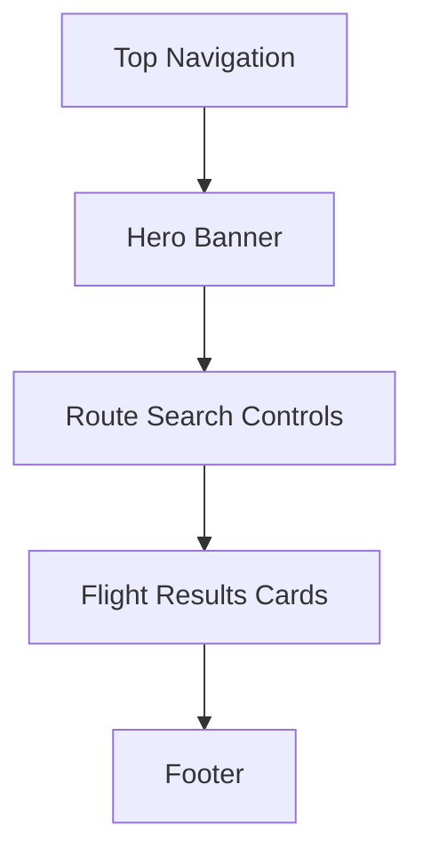
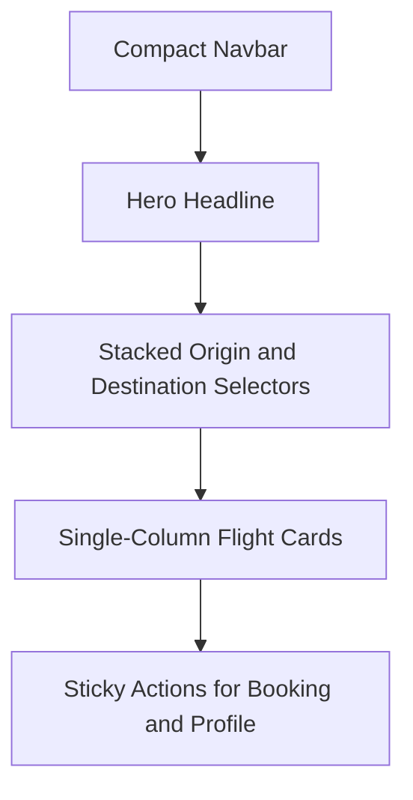
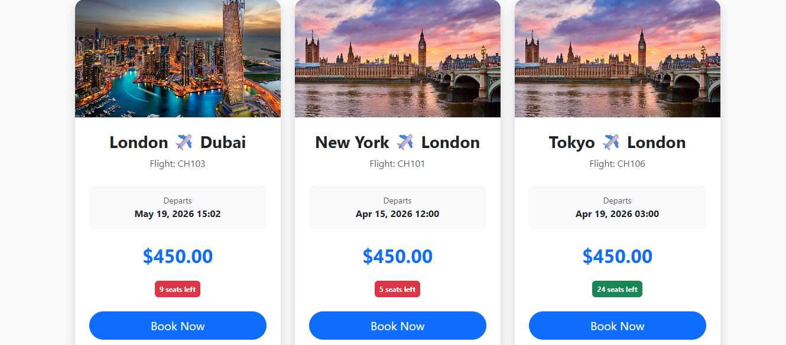
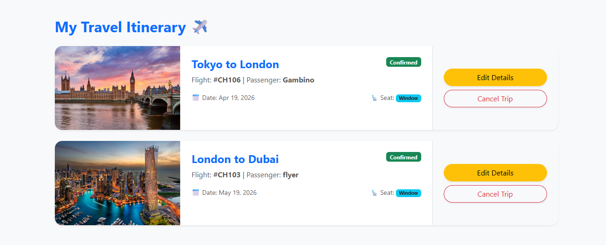
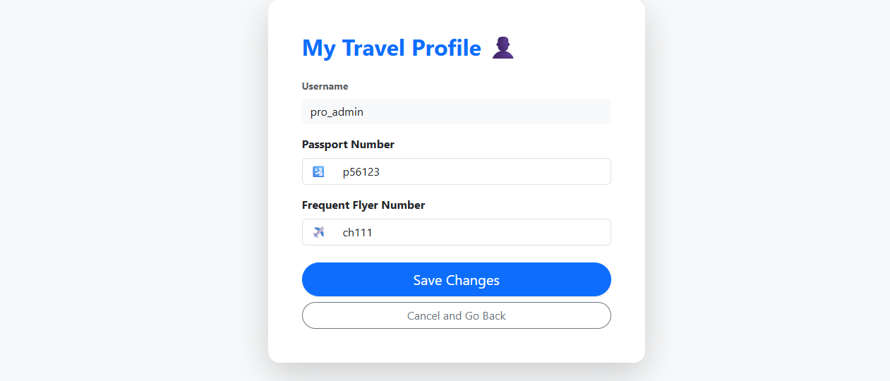
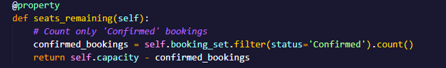
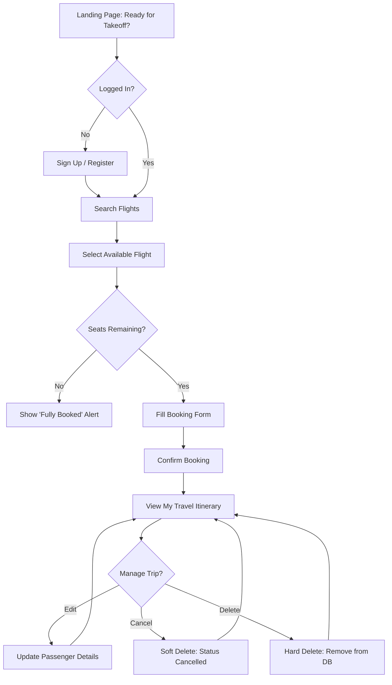
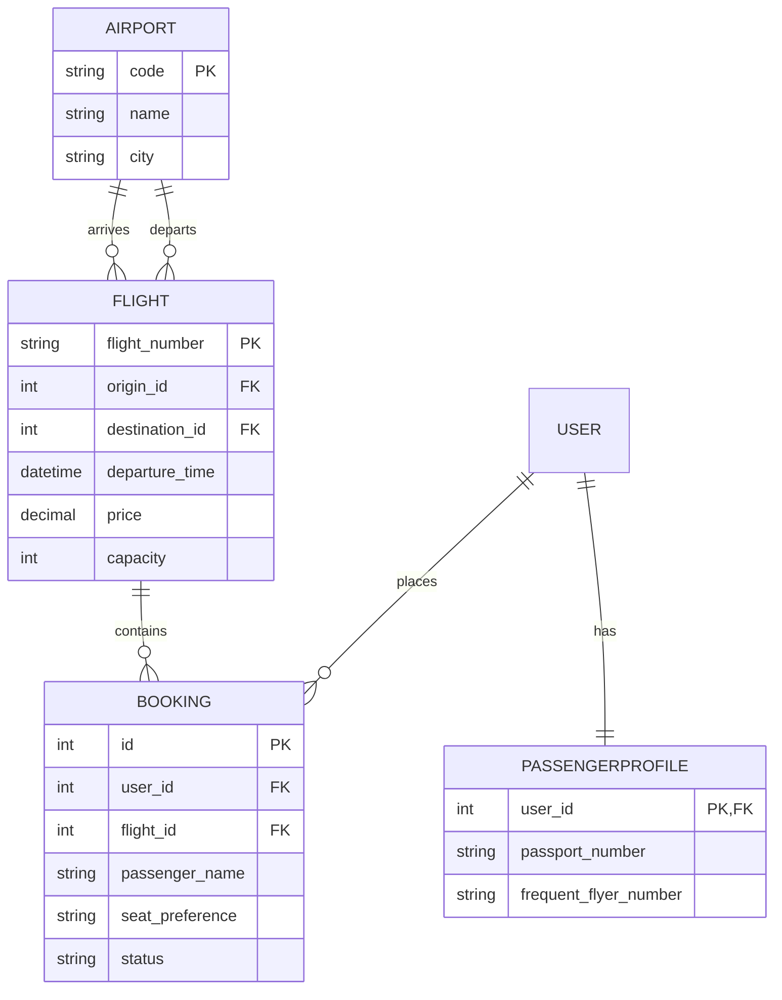

# ☁️ CloudHop | Full-Stack Flight Booking System

## Ready for Takeoff? 🛫


CloudHop is a premium flight booking platform built with **Django** and **PostgreSQL**. It allows users to search for real-time flight routes, manage personal travel itineraries with full CRUD functionality, and maintain a secure travel profile.

**[Visit the Live Website](https://cloud-hop-5647c9f84dbd.herokuapp.com)**

## Table of Contents

1. [UX Design Process (Criterion 4.3)](#ux-design-process-criterion-43)
1. [Key Features](#key-features)
1. [Technologies](#technologies)
1. [Database Schema](#database-schema)
1. [Testing Documentation (Criterion 6.2)](#testing-documentation)
1. [Deployment Process](#deployment-process)
1. [AI Reflection (Learning Objective 8)](#ai-reflection)
1. [References](#references)

## Marking Checklist

| Criterion | Requirement Summary | Status | Evidence |
| :--- | :--- | :--- | :--- |
| 4.3 | UX process with wireframes, mockups, diagrams, and implementation rationale | Complete | [UX Design Process (Criterion 4.3)](#ux-design-process-criterion-43) |
| 6.2 | Testing procedures, expected vs actual outcomes, and organized results | Complete | [Testing Documentation (Criterion 6.2)](#testing-documentation) |
| Deployment | Clear setup and deployment instructions | Complete | [Deployment Process](#deployment-process) |
| LO8 | AI reflection with validation and learning evidence | Complete | [AI Reflection (Learning Objective 8)](#ai-reflection) |

## Assessment Mapping

| Instructor Requirement | README Evidence | Coverage |
| :--- | :--- | :--- |
| UX process documented with wireframes, mockups, and diagrams | UX goals, wireframe diagrams, implemented mockups, user-flow and ERD diagrams in UX and Database sections | Complete |
| Reasoning for design changes through implementation | Design Changes During Development table with initial idea, final implementation, and UX rationale | Complete |
| Testing procedures and results documented | Manual Testing by User Story matrix with test case, expected outcome, actual outcome, and result | Complete |
| Deployment process clearly documented | Local setup, Heroku deployment, and post-deploy verification steps | Complete |
| Clone/fork guidance for other developers | Run Locally and Fork and Host sections | Complete |
| AI reflection for Learning Objective 8 | AI tools used, contribution areas, validation approach, limits, and learning reflection | Complete |

---

## UX Design Process (Criterion 4.3)

This project was developed using **Agile methodologies**. The design focus was on a "Clean Sky" aesthetic: effortless navigation for travelers in a hurry. This section documents design planning artifacts and how those decisions were carried through to implementation.

### **UX Goals**

- Reduce booking friction with clear search, clear calls to action, and minimal form noise.

- Support returning users with persistent account features (bookings, profile, and rebooking).

- Prevent user error and overbooking through defensive UI and server-side checks.

- Maintain accessibility and readability across desktop and mobile.

### **Wireframes (Low-Fidelity Layout Planning)**

Desktop structure used during planning:



Mobile-first structure used during planning:



### **Mockups and Implemented UI Evidence**

| Screen | Preview | UX Reasoning |
| :--- | :--- | :--- |
| Flight Search and Listing |  | Users can move from search to booking with minimal navigation steps. |
| My Bookings |  | CRUD actions are grouped around each booking card for quick itinerary management. |
| Profile Page |  | Keeps travel details editable in one place to speed up repeat bookings. |
| Seats Remaining Feedback |  | Surfaces capacity constraints early to prevent failed checkout attempts. |

### **Design Changes During Development (With Rationale)**

| Initial Idea | Final Implementation | Why the Change Improved UX |
| :--- | :--- | :--- |
| Basic city text filtering | Airport dropdown filtering by airport ID | Prevented ambiguous city matches and made search more predictable. |
| Simple booking flow | Added seat-capacity check before booking and rebooking | Avoided false confirmations and protected data integrity. |
| Single cancel action | Added both soft cancel (status update) and hard delete | Users can choose between reversible and permanent actions. |
| Manual profile setup | Auto-created profile via Django signals | Removed setup friction for new users and reduced missing-profile errors. |
| Limited support route | Added dedicated contact form | Created a clear support path when users need help. |

### **User Stories**

- **Flight Search:** As a User, I can search for flights by origin and destination.

- **Booking:** As a User, I can book a flight and receive a confirmation.

- **Manage Itinerary:** As a User, I can view, edit, and cancel my bookings.

- **User Profile:** As a User, I can save my passport and frequent flyer details.

- **Admin Management:** As a Staff Member, I can manage flights via the admin dashboard.

### **Project Management**

The development was managed using an Agile Kanban board to track features to completion.

| Project Board: Status - Done 8 |
| :---: |
|  |

- **[View the Agile Project Board](https://github.com/Saikou813/CloudHop/projects)**

---

## Key Features

- **Smart Flight Search:** Filter by origin and destination using dynamic dropdowns and Django Q objects.

- **Full CRUD Itinerary:**
  - **Create:** Book flights with real-time seat tracking.
  - **Read:** View personalized trip cards with destination imagery.
  - **Update:** Edit passenger names and seat preferences.
  - **Delete/Rebook:** "Soft-delete" (cancel) or "Hard-delete" (wipe) bookings.

- **User Profiles:** Automatic profile creation via **Django Signals**.

- **Responsive UI:** A premium "Cloud-Grey" aesthetic built with **Bootstrap 5**.

---

## Technologies

- **Backend:** Django 4.2.29 (Python 3.12.2)

- **Database:** PostgreSQL (Heroku Postgres)

- **Image Hosting:** Cloudinary

- **Authentication:** Django Allauth

- **Deployment:** Heroku

- **Frontend:** HTML5 / CSS3 / JavaScript / Bootstrap 5

### **Full Dependency List**

```text
asgiref==3.11.1
certifi==2026.2.25
cffi==2.0.0
charset-normalizer==3.4.5
cloudinary==1.44.1
cryptography==46.0.5
defusedxml==0.7.1
dj-database-url==0.5.0
dj3-cloudinary-storage==0.0.6
Django==4.2.29
django-allauth==0.57.2
gunicorn==20.1.0
idna==3.11
oauthlib==3.3.1
psycopg2==2.9.11
pycparser==3.0
PyJWT==2.11.0
python3-openid==3.2.0
requests==2.32.5
requests-oauthlib==2.0.0
setuptools==81.0.0
six==1.17.0
sqlparse==0.5.5
tzdata==2025.3
urllib3==1.26.20
whitenoise==5.3.0
```

---

## Database Schema

### **Airport Model**

| Name | Type | Purpose | Validation |
| :--- | :--- | :--- | :--- |
| `code` | CharField | 3-letter IATA code for the airport | Max_length=3, Unique=True |
| `name` | CharField | Full name of the airport | Max_length=100 |
| `city` | CharField | The city where the airport is located | Max_length=100 |

### **Flight Model**

| Name | Type | Purpose | Validation |
| :--- | :--- | :--- | :--- |
| `flight_number` | CharField | Unique identifier for the flight | Unique=True |
| `origin` | ForeignKey | Starting airport (links to Airport model) | Related_name="departures" |
| `destination` | ForeignKey | Arrival airport (links to Airport model) | Related_name="arrivals" |
| `departure_time` | DateTimeField | Date and time of departure | Required |
| `price` | DecimalField | Cost of the flight ticket | Max_digits=10, 2 dec places |
| `flight_image` | CloudinaryField | Destination photo for the search cards | Default='placeholder' |
| `capacity` | PositiveIntegerField | Total seats available on the aircraft | Default=150 |

### **Booking Model**

| Name | Type | Purpose | Validation |
| :--- | :--- | :--- | :--- |
| `user` | ForeignKey | The user who made the booking | Required |
| `flight` | ForeignKey | The specific flight being booked | Required |
| `passenger_name` | CharField | Name of the person traveling | Max_length=100 |
| `seat_preference` | CharField | Passenger's choice of Window or Aisle | Window / Aisle choices |
| `status` | CharField | Tracks if the trip is Confirmed or Cancelled | Confirmed / Cancelled |
| `created_at` | DateTimeField | Timestamp of when the booking was made | Auto_now_add=True |

### **PassengerProfile Model**

| Name | Type | Purpose | Validation |
| :--- | :--- | :--- | :--- |
| `user` | OneToOneField | Link to the User account (via Signals) | Related_name="profile" |
| `passport_number` | CharField | Stores passenger travel document info | Max_length=20, Blank=True |
| `frequent_flyer_number` | CharField | Stores loyalty program identifier | Max_length=20, Blank=True |

#### **Automated Profile Creation (Django Signals)**

To ensure every traveller has a profile ready for their passport details, I implemented **Django Signals**.

- **Automated Workflow:** Whenever a new `User` is created, a `post_save` signal triggers the creation of a corresponding `PassengerProfile`.

- **Data Integrity:** This ensures the 1-to-1 relationship is always maintained without manual intervention.

- **[View the Signals Logic](flights/signals.py)**

### **ContactMessage Model**

| Name | Type | Purpose | Validation |
| :--- | :--- | :--- | :--- |
| `name` | CharField | Name of the person sending the inquiry | Max_length=100 |
| `email` | EmailField | Contact email for the support response | Required |
| `subject` | CharField | Brief topic of the message | Max_length=200 |
| `message` | TextField | Full details of the user's inquiry | Required |

### **User Flow Diagram**

The following diagram outlines the primary "Happy Path" for a CloudHop traveller, from initial search to managing their confirmed itinerary. It also highlights the "Defensive Design" logic that prevents overbooking.



### **Entity Relationship Diagram**

The following diagram illustrates the relationships between the core models in the CloudHop system, highlighting the One-to-Many links between Airports, Flights, and Bookings, as well as the One-to-One Signal-based link for User Profiles.



## Testing Documentation

### **Testing Approach**

Testing combined feature-based manual checks, user-story validation, and defensive edge-case testing (for example, sold-out flight scenarios and booking state transitions). The matrix below records the test case, expected outcome, actual outcome, and result.

### **Manual Testing by User Story**

| ID | Feature / User Story | Test Case | Expected Outcome | Actual Outcome | Result |
| :--- | :--- | :--- | :--- | :--- | :--- |
| T01 | Flight search | Select departure and arrival from dropdowns and submit search | Only matching routes are displayed | Matching routes displayed correctly | Pass |
| T02 | Book a flight | Logged-in user submits valid booking form | Booking is saved and success message appears | Booking saved and success message shown | Pass |
| T03 | Overbooking prevention | Attempt to book when no seats remain | Booking is blocked with error feedback | Booking blocked with clear error message | Pass |
| T04 | View itinerary | Open My Bookings page as logged-in user | User sees only their bookings, newest first | Correct user-only list shown in descending order | Pass |
| T05 | Edit booking | Update passenger name and seat preference | Booking updates and confirmation message appears | Record updated and message shown | Pass |
| T06 | Soft cancel | Cancel a booking from itinerary page | Booking status changes to Cancelled | Status updated to Cancelled | Pass |
| T07 | Hard delete | Confirm permanent delete for a booking | Booking is removed from database | Booking removed and no longer shown | Pass |
| T08 | Rebook cancelled flight | Rebook a cancelled booking when seats exist | Status returns to Confirmed | Status updated to Confirmed | Pass |
| T09 | Rebook sold-out flight | Rebook when seats are unavailable | Rebook is blocked with clear message | Rebook blocked with sold-out message | Pass |
| T10 | Profile management | Save passport and frequent flyer details | Profile values are persisted to user profile | Profile updates saved successfully | Pass |
| T11 | Contact form | Submit valid contact message | Message stores and success feedback appears | Message saved and success message shown | Pass |
| T12 | Access control | Visit booking/profile routes while logged out | User is redirected to login page | Redirected to login as expected | Pass |

### **Additional Cross-Browser and Device Checks**

- Desktop: Chrome, Edge, and Firefox.

- Mobile/Tablet simulation: Chrome DevTools responsive modes.

- Layout evidence: `am_i_responsive.png` confirms responsive behavior across common breakpoints.

### **Validation and Code Quality Checks**

- **Python:** Checked with Pep8CI during development and refactoring.

- **HTML/CSS:** Validated with W3C HTML Validator and Jigsaw CSS Validator.

- **Markdown:** README reviewed for heading structure, code-fence balance, and Mermaid parsing compatibility for GitHub.

### **Testing Gaps and Next Iteration**

- Expand automated Django tests beyond the current starter model test.

- Add integration tests for booking state transitions (Confirm, Cancel, Rebook, Delete).

- Add regression tests for permissions and object-level access control.

---

## Deployment Process

This section provides step-by-step instructions to run the project locally, deploy to Heroku, and host a personal fork.

### **Live Site**

- **Production URL:** [https://cloud-hop-5647c9f84dbd.herokuapp.com](https://cloud-hop-5647c9f84dbd.herokuapp.com)

### **Run the Project Locally (Clone and Setup)**

1. Clone the repository:

```bash
git clone https://github.com/Saikou813/CloudHop.git
cd CloudHop
```

1. Create and activate a virtual environment:

```bash
python -m venv .venv
# Windows
.venv\Scripts\activate
# macOS/Linux
source .venv/bin/activate
```

1. Install dependencies:

```bash
pip install -r requirements.txt
```

1. Create an `env.py` file in the project root (do not commit secrets):

```python
import os

os.environ["DATABASE_URL"] = "your_postgres_database_url"
os.environ["SECRET_KEY"] = "your_secret_key"
os.environ["CLOUDINARY_URL"] = "your_cloudinary_url"
```

1. Apply migrations and load airport seed data:

```bash
python manage.py migrate
python manage.py loaddata flights/fixtures/airports.json
```

1. Run the development server:

```bash
python manage.py runserver
```

1. Open the app in a browser:

```text
http://127.0.0.1:8000/
```

### **Deploy This Project to Heroku**

1. Create a Heroku app.

1. Add Heroku Postgres.

1. Set Config Vars in Heroku:
    - `SECRET_KEY`
    - `DATABASE_URL`
    - `CLOUDINARY_URL`

1. Connect the Heroku app to the GitHub repository.

1. Deploy the `main` branch.

1. Run release commands:

```bash
heroku run python manage.py migrate -a <your-app-name>
heroku run python manage.py loaddata flights/fixtures/airports.json -a <your-app-name>
```

1. Open and verify the deployed app:

```bash
heroku open -a <your-app-name>
```

### **Fork This Repository and Host Your Own Version**

1. Fork the repository on GitHub.

1. Clone your fork locally.

1. Create your own Postgres and Cloudinary credentials.

1. Update `ALLOWED_HOSTS` in Django settings for your own domain and Heroku app URL.

1. Deploy your fork to your own Heroku app using the steps above.

---

## AI Reflection

### **AI Tools Used**

- GitHub Copilot

- Google

### **How AI Supported the Project**

| Area | AI Contribution | Outcome in Project |
| :--- | :--- | :--- |
| Feature scaffolding | Suggested structure for CRUD views, forms, and URL flow | Faster implementation of booking and itinerary management |
| Defensive logic | Helped reason about seat-capacity checks and rebooking safeguards | Reduced risk of overbooking and invalid state transitions |
| UX iteration | Proposed layout and messaging improvements for booking flow | Cleaner user journeys and clearer user feedback |
| Deployment troubleshooting | Helped diagnose config and environment issues | Faster Heroku deployment recovery |
| Documentation support | Assisted in drafting and refining README structure | Clearer technical and process documentation |

### **How AI Outputs Were Validated**

1. Every suggestion was reviewed before implementation.

2. AI-generated code was adapted to match project models and naming conventions.

3. Features were manually tested in browser flows before being accepted.

4. Guidance was cross-checked against Django and Heroku documentation when needed.

### **Where AI Was Not Used**

- Final acceptance decisions on UX and scope.

- Final project prioritization and MVP decisions.

- Manual end-to-end validation of user stories.

- Personal reflection and learning conclusions.

### **Learning Reflection**

1. AI was most valuable as a debugging and acceleration partner, not as a replacement for understanding.

2. The best outcomes came from using AI iteratively and validating each change in context.

3. Defensive coding patterns (validation, edge-case checks, and feedback messaging) became a stronger habit through AI-assisted review.

4. Clear prompting improved answer quality, but domain verification remained essential.

---

## References

- **Django Documentation:** [Django Docs](https://docs.djangoproject.com/)

- **Heroku Deployment Docs:** [Heroku Python Support](https://devcenter.heroku.com/categories/python-support)

- **Mermaid Diagram Docs:** [Mermaid ER Diagram Syntax](https://mermaid.js.org/syntax/entityRelationshipDiagram.html)

- **HTML Validator:** [W3C Validator](https://validator.w3.org/)

- **CSS Validator (Jigsaw):** [Jigsaw CSS Validator](https://jigsaw.w3.org/css-validator/)

- **Python Style Checker (Pep8CI):** [Pep8CI](https://pep8ci.herokuapp.com/)

- **UI Framework:** [Bootstrap 5](https://getbootstrap.com/)

- **Media Hosting:** [Cloudinary Documentation](https://cloudinary.com/documentation)

- **Images and Visual Assets:** Unsplash and project-owned screenshots in `docs/images/screenshots/`

- **Learning Support:** Code Institute curriculum, Google, W3Schools, and Stack Overflow.
